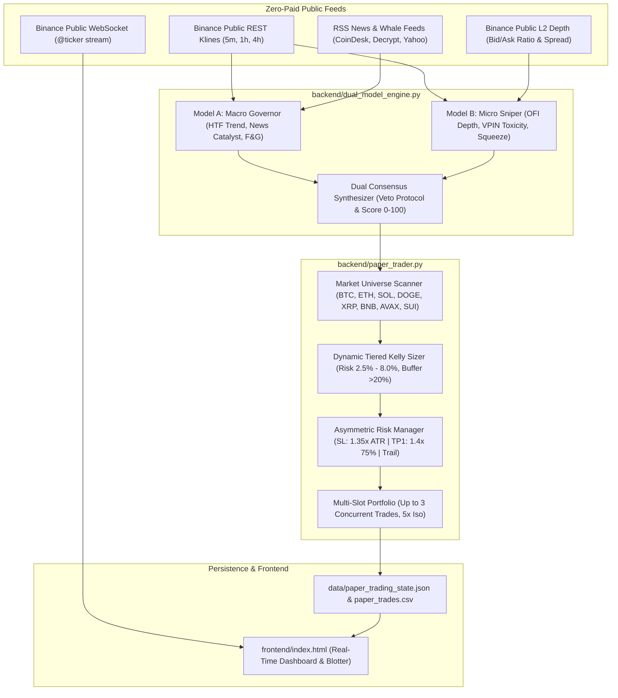

# 🚀 LayaQuant Studio — Master Project Handover & Architecture Blueprint

> **Document Version**: 2.5 (Production Hardened)  
> **Last Updated**: September 25, 2026  
> **Prepared For**: Claude Opus / Autonomous Senior Quant Engineer  
> **Repository Path**: `c:/Users/mansour/Documents/antigravity/gallant-bell`

---

## 0. READ FIRST — Strategy Status (2026-09-25)

**The 5m dual-model scalper described in §4 has no edge.** `backend/backtest_live_strategy.py` replays its exact
signal code on 90 days of Binance USD-M 5m data (8 symbols): gross expectancy +0.008R/trade (PF 1.03, i.e. noise);
after fees/slippage −0.09R/trade. No exit/filter variant tested was profitable. Its paper P&L looked good only
because of simulator bugs (fixed — see §5.5).

**The live paper trader now defaults to `strategy_mode = "TREND"`** (`backend/trend_strategy.py`):
4h Donchian 120-bar breakout, long-only, 60-bar channel exit, 4×ATR(20) chandelier stop, 1% equity risk/trade,
≤1× equity notional per position, ≤3× gross. Taker fills + slippage, funding charged at each 8h settlement.
The old scalper is still available: `POST /api/paper/set_strategy_mode {"mode": "SCALPER"}`.

Validation (`python -m backend.backtest_trend`, real klines + real funding history, 2020-01 → 2026-09):

| | In-sample 2020-24 | Out-of-sample 2024-07 → 2026-09 |
|---|---|---|
| Selected config (chosen on IS Sharpe only) | CAGR 49%, Sharpe 1.65, maxDD −19% | **CAGR 30%, Sharpe 1.17, maxDD −26%** |
| BTC buy & hold | CAGR 60%, Sharpe 1.07, maxDD −77% | CAGR 14%, Sharpe 0.52, maxDD −53% |
| Same exits, random long entries (5 seeds) | — | Sharpe 0.2–0.9 (avg ≈0.66) |

- All 42 grid configs (1d/4h, N, stop, long/long+short) had positive OOS Sharpe (0.34–1.29) → edge is not a single lucky setting.
- The random-entry control shows a large part of the return is long crypto drift + cut-losers/let-winners-run exits; the breakout entry roughly doubles it.
- Expect long flat/down stretches (2022: −2.5%; 2025 −9% for the daily variant). Win rate is ~35–45%; profits come from a few large trends.
- 2.2 years OOS is still a small sample. Paper-trade it before risking money; do not raise risk above 1% on this evidence.

**Can it do €500 → €10k in months? (`python -m backend.growth_study`)** Same rules, leverage caps raised to 10×/position
and 20× gross, liquidation modelled, a fresh $500 account started every 2 weeks from 2020-03 to 2025-08 (144 overlapping
12-month windows):

| Risk/trade | $10k within 6 mo | within 12 mo | Wiped out | Median after 12 mo |
|---|---|---|---|---|
| 1% (live) | 0% | 0% | 0% | $681 |
| 5% | 6% | 17% | 0% | $1,149 |
| 10% | 11% | 24% | 3% | $1,371 |
| 15% | 17% | 31% | 35% | $598 |
| 20% | 19% | 26% | 58% | $192 |

- Nearly all windows that reached $10k started in 2020 (the 2020-21 bull run); no window starting in 2022 or 2025 got there at any risk level.
- Out of sample (2024-07 → now) no risk level reached $10k; the best was 5% risk → $1,915 with an −81% drawdown on the way.
- Growth peaks around 5–10% risk. Above that the median result falls and the chance of being wiped out rises quickly.

**Does Laya improve entries? (`python -m backend.laya_filter_test`)** No. On all 452 trend entries since 2020-04:
- The prompt `server.py` sends today (RSI/SMA criteria) says "buy" on only 4 breakouts. Used as a gate it would skip
  trades worth +268R and keep 4 losers (−1.8R), because its criteria call RSI > 65 "sell" and breakouts have high RSI.
- A trend-specific prompt ("will this breakout continue?") has zero correlation with the outcome (+0.005). Filtering on it
  did no better than skipping the same number of trades at random.
- Laya is a general text classifier (ModernBERT, trained on email triage / intent / NLI), not a market model. In TREND mode
  the paper trader does not call it at all; in SCALPER mode it is only the fallback when `neural_dream` fails.

**What the goal needs.** At the growth-optimal (Kelly) leverage, a strategy with Sharpe S grows the median account by
about exp(S²/2) per year, and at full Kelly there is a 50% chance of halving along the way. 20× in 12 months needs S ≈ 2.5,
in 6 months S ≈ 3.5. The live trend strategy (S ≈ 1.2 out of sample) tops out near 2× a year, which matches the growth
study (best out-of-sample result: 5% risk, +86%/yr, −81% drawdown).

**News safety brake (`backend/news_guard.py`), shadow mode.** Laya answers yes/no questions per headline (hack, exchange
withdrawal halt/insolvency, delisting, regulator action, depeg, outage); market-wide and outage flags also need a keyword.
Correct on 26/26 hand-labelled headlines, but replayed on 2020-2024 news (`backend/news_guard_backtest.py`, 229k-headline
CoinDesk/CryptoCompare archive) it would have skipped 105 of 344 trend entries whose average was *better* than the rest
(+0.91R vs +0.61R): real news is full of "Celsius exits bankruptcy" / "Tether freezes wallets" noise, and breakouts rarely
happen during real crashes (there was no entry during FTX). So it only logs and shows NEWS FLAG on the scanner;
`POST /api/news_guard/enforce?on=true` makes it block entries. `python -m backend.news_guard --report` judges the live log.

**Other strategies (`backend/strategy_lab.py`, point-in-time universe from `backend/universe_data.py`, delisted coins
included).** Out-of-sample (2024-07 → now) Sharpe; parameters chosen on 2020-06 → 2024-06 only:

| Strategy | In-sample Sharpe | Out-of-sample Sharpe |
|---|---|---|
| Trend, live 8 coins (baseline) | 1.68 | **1.17** |
| Trend, top-30 by volume | 0.88 | 0.54 (coins enter the top 30 during pumps, breakouts buy the top) |
| Cross-sectional momentum, best in-sample setting | 1.11 | −0.02 |
| Funding carry, best in-sample setting | 4.21 | −0.52 (funding premia compressed since 2024) |
| Equal-risk combination of the three above | 3.42 | −0.33 (−28%/yr, −77% drawdown) |
| Trend ensemble (9 lookbacks, vol-sized, Zarattini 2025), 8 coins | 1.74 | 0.42 |
| Same, monthly top 20 | 0.68 | 0.59 |

The combination row is the trap to avoid: in 2024 it looked like the Sharpe-3 system the goal needs, then lost 77%.

**Trained entry filters (`backend/ml_lab.py`).** 1,724 trend trades on the top-30 universe, models retrained each year on
trades that had already closed. LightGBM (AUC 0.49) and logistic regression (0.50) found nothing. Laya's frozen encoder
embeddings of the features as text + a logistic head looked real at trade level (kept +0.29R vs dropped +0.01R; random
does as well 1%; stable across regularisation; not coin identity). But on the live 8-coin strategy with every breakout
signal scored (`--portfolio`, 42% of signals skipped) it is no better than skipping at random: Sharpe 2021-24H1 1.76 vs
1.71 unfiltered, 2024H2+ 1.09 vs 1.17, random skips 0.95–1.19. A skipped breakout usually re-triggers on the next bar,
so the filter mostly delays entries. A full fine-tune of the 421M-parameter model on ~1.7k trades would overfit; not
worth doing. No filter is used live.

**Long/short with separate levers (`backend/levers_lab.py`).** `TrendParams.short_risk_pct` lets shorts use their own
risk (`allow_long` switches longs off). The short book alone loses in both periods (Sharpe −0.14 in-sample, −0.27 out of
sample); it only helps in bear years (+15% 2022, +13% 2026 so far). Adding shorts lowers out-of-sample Sharpe at every
lever: long-only 1.17, +0.25% shorts 1.09, +0.5% 0.98, +1% 0.75. The live bot stays long-only.

**Deposit plan: 500 + 100/month → 10,000 (`levers_lab.py`, paper trader `POST /api/paper/recurring_deposit`).**
At a steady +30%/yr it takes 49 months; +50%/yr 40 months. Bootstrapping 30-day blocks of the out-of-sample returns
only: 2% risk → 50% chance within 36 months, 3% → 67% (median 28 months), with a ~1-in-4 chance of being below the
money deposited after 24 months.

**Hype / attention / sentiment (`backend/hype_lab.py`, `backend/telegram_data.py`).** Measured in the 72h before each
trend entry and split into thirds, with a permutation test: news-headline attention, Laya's tone and hype of those
headlines, English Wikipedia pageviews, the @WatcherGuru Telegram channel (attention, Laya tone/hype) and Whale Alert
exchange in/outflows for the coin and for USDT+USDC. Nothing is both significant and stable. News attention looked
significant before 2024-07 (high attention worse, p≈1%) and flipped after; Wikipedia attention looked very significant
after 2024-07 (rising attention better, p<0.1%) but was the other way round in 2020, 2023 and 2024. Measures that flip
sign between periods would hurt as filters. Public Telegram channels can be read with history via t.me/s pages (no
login); X needs a paid API and Reddit's API refuses these requests.

**Free insight sources (`backend/insight_lab.py`).** Binance futures metrics (open interest, top-trader / all-account
long-short ratios, taker buy/sell ratio; data.binance.vision daily files), Fear & Greed (alternative.me), stablecoin
supply (DefiLlama), Deribit DVOL and the Coinbase premium, each taken the day before every trend entry. Long/short
ratios and 30-day OI change flip sign between periods. Fear & Greed, taker ratio, DVOL, Coinbase premium and stablecoin
growth keep their sign but are only significant in one period each. A blend chosen on 2020-03 .. 2024-06 data only
(`--composite`) gave Sharpe 1.23 vs 1.17 unfiltered after 2024-07, inside the 1.01–1.23 range of skipping the same share
of signals at random: a hint, not an edge. Not used live.

**Attention dilution.** The number of active Binance perps (tokens competing for the same attention and money) sorts
trend outcomes the same way in both periods (fewer perps → better trades), but it only rises, so it is a time trend,
not a filter. It is consistent with the edge shrinking as the market fills up: +0.68R per trade before 2024-07,
+0.43R after. Expect somewhat less than the backtest. Attention measures in `hype_lab.py` also come as shares of
attention across the 8 coins (`*_share`), so a market-wide frenzy is not read as coin-specific hype.

**Shorting new listings (`backend/listing_lab.py`).** Short every new USDT perp 1–7 days after listing, hold 14–30
days, stop at +30/60%. Listings before 2024-07 (220): mean −2.9% to +0.9% per trade, no edge. Listings since (~550, the
2024-26 memecoin/AI flood): +2.3% to +3.3% per trade in every setting. Chosen on the earlier data it would have been
rejected; regime-dependent and exposed to squeezes, so paper-trade only if at all.

**Small-capital edges.** Edges too small for funds are the natural place for a small account; tested:
- Exchange announcements (`backend/event_lab.py`; events from the official Telegram channels @binance_announcements
  2017 on, @upbit_news 2025-05 on, @bithumb_notice 2026-05 on; traded on the Binance perp with 1-minute bars, entry
  60-120 s after the post, 0.7% round-trip costs + funding). Upbit listings: price is already up a median +13% before
  a normal bot can enter; buying loses (−11% over 24h). Fading them (short, hold 24h): +7.2%/trade, 70% win, n=27, but
  +12% in the first half of events vs +2% in the second, stops at 10/20% turn it negative, and it has to sit through
  squeezes of up to +43%. Binance delistings, short and hold 4h: +3.6%/trade after funding, 63% win, n=67, stable
  across halves (+3.4% / +3.8%) — the best find, but ~27 events a year and fat tails (one +180% squeeze inside 4h), so
  sized to survive a 200% squeeze it adds only a few % a year. Binance listing fades and Bithumb listings (n=18): no
  edge. The public Upbit notice API is Cloudflare-blocked from the research server.
- Daily reversal / momentum in the top 50-100 coins (`backend/smallcap_lab.py`): both directions lose after
  0.15%/side costs (turnover 56-104% a day).
- Shorting new listings (`listing_lab.py`, above): only since 2024-07.
The trend strategy already runs fine on €500 (positions of roughly €50-150); for a small account the deposit rate and
the risk level move the result far more than any of these.

**Final hype/attention run** (all Whale Alert history 2019 on, `*_share` measures): still nothing consistent. Share of
attention flips sign between periods for news, Wikipedia and Telegram; whale exchange inflows and stablecoin inflows
keep their sign but are not significant after 2024-07.

**Stocks + crypto: the one thing that raised the Sharpe (`backend/cross_asset_lab.py`).** Time-series momentum
on ETFs (hold an ETF while its 12-month return is positive, volatility-sized, monthly; Moskowitz-Ooi-Pedersen 2012)
earns on its own (12 ETFs 2007-now: +15.5%/yr, Sharpe 0.83, max DD −39%) and is nearly uncorrelated with the crypto
trend book (daily correlation +0.09). Equal-risk mix, weights fixed in advance: out-of-sample Sharpe 1.78 vs 1.17 for
crypto alone (the ETF book had unusually good 2024-26 years). Stricter check, drawing ETF months from 2007-now
(2008 and 2016-18 included) and crypto months from 2024-07 on, 500 + 100/month, at 2% crypto-equivalent risk: 10k
within 36 months 68% (crypto alone 50%), below the deposits at 24 months 9% (crypto alone 21%). Restricted to what
Binance Futures lists as USDT "TradFi" perpetuals since 2026 (SPY, QQQ, gold XAU, silver XAG; operated by
ADGM-regulated Nest Exchange) the numbers are nearly the same (ETF book Sharpe 0.88, correlation +0.08), so the same
bot and account could run both books. Not built into the paper trader yet; TradFi perp funding and regional
availability still to check.

**The plan tool (`frontend/plan.html`, http://127.0.0.1:8000/plan; paper money).** The user picks budget, risk
level (1-3), monthly deposit and target; `POST /api/plan/start` resets the paper account and runs both books:
- Crypto trend (unchanged rules, 8 coins) at risk per trade = 0.68% x level.
- TradFi trend (`backend/tradfi_book.py`): XAUUSDT, XAGUSDT, SPYUSDT, QQQUSDT perps. Once a month, long an asset
  while its ETF's (GLD/SLV/SPY/QQQ, Yahoo Finance) 12-month return is positive, sized to (14.6% x level)/sqrt(4)
  yearly volatility each; caps 1.5x equity per asset, 3x total; positions within 20% of target are left alone.
  Marked at the perps' Binance mark price, funding charged, taker fee + slippage on every change.
- Level mapping makes both books carry equal risk as in `cross_asset_lab.py`. Crypto entries only count crypto
  positions against their leverage cap; the scalper exit manager skips TRADFI positions.
- Recurring deposit every 30 days; `/api/plan/pause`, `/api/plan/resume`, `/api/plan/status`. The plan and its
  risk level persist in `data/paper_trading_state.json`.
If Yahoo or the Binance TradFi quotes are unavailable, the rebalance waits and retries every 15 minutes (shown on the
page). Tested with mocked prices (entries, rebalance, trend flips, deposits, reload) and a live server smoke test;
Binance is geo-blocked from the research server, so live quotes were not exercised there.

**Internet/Reddit survey (2026-09).** LLMs trading on their own lost money in the Alpha Arena live contest (4 of 6
models down; Claude −42%, Gemini −46%); Reddit "ChatGPT trader" stories are weeks-long and unverified; bots
advertising ~1%/day are not credible. AI reading news for small stocks (Lopez-Lira & Tang) is documented but
reportedly decayed after 2023, and free stock-news data (FNSPID) ends in 2023, so it can't be checked on recent years.
Prediction markets were researched and dropped at the user's request (`backend/predmarket_lab.py` unused).

**Bottom line (2026-09-25).** Nothing tested beats the live 8-coin trend strategy out of sample. Its ceiling is roughly
2× a year at ~5% risk per trade with deep drawdowns; ~1% risk (+30%/yr, −26% drawdown) is the sane setting, 2–3% if
the user accepts deeper drawdowns for the deposit plan.

---

## 1. Executive Summary & Purpose

**LayaQuant Studio** is an autonomous, 100% open-source, zero-paid-API quantitative trading desk and real-time paper trading engine engineered for crypto perpetual futures. 

### Core Mission
Scale an initial bankroll of **€500.00 to €10,000.00** (+1,900% / 20x gain) without crossing the Kelly overbetting cliff, utilizing:
- **Dual-Model Consensus AI**: System 2 Macro Governor (Model A) + System 1 Microstructure Sniper (Model B) with institutional Veto Armor.
- **Dynamic Milestone Tiered Kelly Compounding**: Geometric position scaling modulated across 4 capitalization milestones with automatic defensive throttles.
- **Strict Asymmetric Risk Architecture**: 1.35x ATR Initial Stop Loss, 1.40x ATR Take-Profit 1 (75% scalp lock), and a 2.70x ATR trailing runner.
- **Zero-Paid-API Constraint**: Public Binance REST/WebSocket endpoints and open-source models/scrapers.

---

## 2. Directory Structure & File Inventory

```
c:/Users/mansour/Documents/antigravity/gallant-bell/
├── backend/
│   ├── server.py                        # FastAPI microservice (API routes, startup recovery, UI serving)
│   ├── paper_trader.py                  # Core trading engine (state machine, order lifecycle, blotter, scanner)
│   ├── dual_model_engine.py             # Model A (Macro Governor) + Model B (Micro Sniper) + Consensus Synthesizer
│   ├── neural_dream.py                  # 18-D PyTorch Neural Policy Net & offline dream learning loop
│   ├── news_engine.py                   # Zero-cost live RSS & Twitter sentiment scraper with NLP catalyst scoring
│   ├── research_engine.py               # Microstructure math: Lopez de Prado VPIN, Kyle lambda, behavioral metrics
│   ├── institutional_compounding_engine.py # Multi-asset compounding futures backtester & squeeze detector
│   ├── walk_forward_5m_futures.py       # Out-of-sample walk-forward validation framework
│   └── requirements.txt                 # Python dependencies
├── frontend/
│   └── index.html                       # Real-time Bloomberg/TradingView terminal UI (vanilla JS, Tailwind, Chart.js)
├── data/
│   ├── paper_trading_state.json         # Real-time persisted state (equity, positions, radar, indicators)
│   ├── paper_trades.csv                 # Detailed trade blotter log (fills, gross, fees, net PnL, RRR, reasons)
│   ├── live_sessions_history.json       # Historical session archive for post-trade equity curve telemetry
│   └── neural_market_model.pt           # PyTorch weights for the 18-D neural policy model
├── run.bat                              # Windows one-click launcher
├── run.sh                               # Unix launcher
└── CLAUDE_HANDOVER.md                   # This master developer document
```

---

## 3. High-Level Architecture & Data Flow



---

## 4. Detailed Component Breakdown

### A. The Dual-Model AI Engine (`backend/dual_model_engine.py`)

#### 1. Model A — Macro Governor (`LayaMacroGovernor`)
- **Higher Timeframe Regime Detection**: Classifies market into `TREND_BULL`, `TREND_BEAR`, `RANGE_BOUND`, or `TOXIC_CHOP` using 4-hour / 1-hour 50/200 EMA alignment and ATR expansion.
- **Directional Permit**: Emits `PERMIT_LONG`, `PERMIT_SHORT`, `PERMIT_BOTH`, or `ENFORCE_CASH`.
- **Governor Hard Veto**: Automatically blocks all trades if:
  - Macro regime is `TOXIC_CHOP` (high ATR expansion + flat moving average spread).
  - High-impact FUD catalyst is detected against the asset (e.g., hacks, regulatory actions).
  - Andrew Lo Adaptive Market Hypothesis (AMH) extreme sentiment throttle: caps leverage when Fear & Greed is extreme.

#### 2. Model B — Micro Sniper (`LayaMicroSniper`)
- **Microstructure Order Flow (OFI)**: Evaluates bid/ask order book depth ratio from public Binance order books:
  - If buying: requires Bid/Ask ratio >= 0.85 (OFI veto triggered if ask wall heavily outweighs bids).
  - If shorting: requires Bid/Ask ratio <= 1.15 (veto if heavy bid wall resting support).
- **VPIN Flow Toxicity (Lopez de Prado)**: Calculates Volume-Synchronized Probability of Toxicity. If VPIN >= 0.70, triggers toxicity veto to prevent adverse selection.
- **Bollinger-Keltner Volatility Squeeze**: Detects volatility compression when 20-period Bollinger Bands contract entirely inside 1.5x ATR Keltner Channels.

#### 3. Consensus Synthesizer (`DualConsensusSynthesizer`)
Combines Model A and Model B into a composite score:
`Score = 50.0 + (MacroConfidence * 25.0) + (TacticalConfidence * 25.0)`
- **Score >= 88.0/100 + Dual Consensus** is strictly required to open a trade.

---

### B. Core Portfolio & Execution Engine (`backend/paper_trader.py`)

#### 1. Multi-Asset Radar Universe
Scans 8 high-liquidity perpetual pairs on every cycle:
`["BTCUSDT", "ETHUSDT", "SOLUSDT", "DOGEUSDT", "XRPUSDT", "BNBUSDT", "AVAXUSDT", "SUIUSDT"]`
Holds up to **3 concurrent positions** across decorrelated pairs.

#### 2. Dynamic Milestone Tiered Kelly Sizing
Positions are sized via a fraction of the Kelly Criterion based on win rate p ~= 0.65 and payoff ratio b >= 1.5:
`Kelly* = (p * (b + 1) - 1) / b`
Modulated across 4 Capital Milestones:
- **Phase 1 (€500 – €1,500)**: Scrappy Growth (Risk = 4.0% - 8.5% of equity).
- **Phase 2 (€1,500 – €3,500)**: Capital Expansion (Risk = 3.0% - 6.5%).
- **Phase 3 (€3,500 – €5,000)**: Milestone Capital Lock (Risk = 2.0% - 4.5%).
- **Phase 4 (€5,000 – €10,000)**: Strict Quarter-Kelly (Risk = 2.0% - 2.5%).
- **Defensive Throttle**: After >= 1 loss, risk is automatically cut by 40% until a win is banked.
- **Liquidity Buffer**: Always preserves a minimum **20% liquid unencumbered cash buffer** to eliminate liquidation risk.

#### 3. Calibrated Risk/Reward Rules
- **Stop Loss**: Strict 1.35x ATR_14 from entry.
- **Take-Profit 1 (Scalp Lock)**: Closes **75% of position** at +1.40x ATR_14 (~1:1 R:R).
- **Runner**: Remaining 25% runner has its stop ratcheted to `entry + 0.2x ATR` (guaranteed risk-free gain) and targets 2.70x ATR_14.
- **Stale Timeout**: 60-minute holding limit if a trade fails to hit TP1.
- **Anti-Churn Cooldown**: 10-minute (600s) mandatory desk pause after closing trades.
- **Maker Post-Only Execution**: Uses limit orders at 0.02% fee rate (saving 73% vs. 0.075% taker).
- **Strict Leverage Cap**: Hard-capped at **5.0x Isolated Margin** across all symbols.

---

## 5. Critical Debugging History & Lessons Learned

> **DO NOT RE-INTRODUCE THESE BUGS.** Claude Opus must be aware of the exact failure modes discovered and resolved:

### 1. The Cross-Symbol Price Contamination Bug (Fixed)
- **Symptom**: Historical log showed account exploding from €500 to $147,195.34 in fake profits.
- **Cause**: In `fetch_klines()`, a fallback line `p = self.current_price` was used during Binance API timeouts. When XRP timed out, it was assigned BNB's $792 price, creating a fake +$95k gain.
- **Fix**: Isolated symbol caches completely. Added the **Absolute Anomaly Guard**: any price tick deviating >25% from entry price is instantly dropped as a corrupted tick.

### 2. The Inverted Risk/Reward Bleed (-€56 with 68% Win Rate) (Fixed)
- **Symptom**: User ran live trading and lost €56 despite winning 51 out of 75 trades (68% win rate).
- **Cause**: Stop loss was 2.2x ATR (loss = -$5.30 on 100% position size) while TP1 closed only 50% at 1.2x ATR (win = +$1.38). Win/loss ratio was 0.26 (3.8x larger losses).
- **Fix**: Tightened SL to 1.35x ATR (cuts loss by 44%), increased TP1 to 75% at 1.4x ATR (lifts avg win to +$2.65). Expectancy flipped from -$0.76 to **+$0.86/trade**.

### 3. The 15-Minute Chokehold & Overnight Chop Bleed (Fixed)
- **Symptom**: Overnight session lost €94 across 165 trades, paying $40.60 in fees.
- **Cause**:
  1. A rigid 15-minute / 25-minute `adverse_atr >= 0.8` scratch dumped 42 trades at market inside normal sideways range noise.
  2. In `backend/paper_trader.py` (line 1438), `intelligent_dream_trainer` was silently overwriting `self.atr_multiplier_stop` back to 2.1x ATR every 10 seconds!
  3. In `RANGE_BOUND` regimes, `score >= 40.0` was permitted as a fallback, machine-gunning 76 entries into a flat 0% market.
- **Fix**:
  - Hard-locked `self.atr_multiplier_stop = 1.35` (banned neural overwrite).
  - Removed premature 25m -0.8x ATR scratches (giving trades 60m to develop).
  - Required `score >= 88.0` AND Volatility Squeeze for `RANGE_BOUND` entries.
  - Increased inter-trade cooldown to 10 minutes (600s).
  - Enforced post-only maker fills (0.02%).

### 4. The Trade Blotter 'Entry = Exit' UI Bug (Fixed)
- **Symptom**: All trade rows in the web UI displayed identical numbers for Entry and Exit.
- **Cause**: Frontend mapped `entryPrice: t.price || 0, exitPrice: t.price || 0`.
- **Fix**: Backend now emits distinct `entry_price` and `exit_price` on all trade objects; frontend displays `--` on open entries and exact execution prices on exits.

### 5. Paper-Simulator Optimism Bugs (Fixed 2026-09-25)
- Entry used the radar's display-rounded price (2dp): up to ±0.5% error on ~$1 coins (SUI/XRP) ≈ 1 ATR of fake P&L. Now uses `price_raw`/`atr_raw`.
- Entry fee was charged on margin, not notional (5× too small at 5× leverage).
- Stops/timeouts/forced/manual exits were billed as maker with zero slippage. Now taker (0.05%) + 2bps, filled at the stop or worse.
- Exits were triggered by the 5m bar's high/low, which includes prices from BEFORE entry and from earlier polls. Now only prices observed since the previous evaluation count.
- TP was checked before SL in the same window; now the stop wins. Trailing ratchet no longer raises the stop from a high and then "hits" it with an earlier low of the same window.
- Kelly sizing had hard floors (4–8.5%) that bet big even with negative Kelly; entry rows (`SELL_SHORT`) counted as losses. Now realized-leg stats, phase values are caps, 0.5% probe size without an edge.
- `evaluate_step` was not locked: the background loop and `/api/paper/step` could close the same position twice (double cash credit). Now serialized with `self.lock`.

---

## 6. How to Run, Test, and Verify

### Prerequisites
- Python 3.10+ (Current runtime: Python 3.11 with PyTorch + CUDA support).
- Windows OS (PowerShell / Command Prompt).

### Launching the System
```powershell
# From repository root:
python -m uvicorn backend.server:app --host 127.0.0.1 --port 8000
```
- Web Dashboard: `http://127.0.0.1:8000`
- API Health Check: `GET http://127.0.0.1:8000/health`
- Paper Trader Status: `GET http://127.0.0.1:8000/api/paper/status`

### Starting / Stopping Paper Trading
- **Via Dashboard**: Click `▶ RECORD LIVE` / `⏹ PAUSE`.
- **Via API**:
  ```powershell
  # Start live loop:
  Invoke-RestMethod -Method POST -Uri "http://127.0.0.1:8000/api/paper/start"
  
  # Stop live loop:
  Invoke-RestMethod -Method POST -Uri "http://127.0.0.1:8000/api/paper/stop"
  ```

### Quick Diagnostic Verification Command
```powershell
python -c "import urllib.request, json; res = json.loads(urllib.request.urlopen('http://127.0.0.1:8000/api/paper/status').read()); print('Status:', res.get('is_running'), 'Equity:', res.get('total_equity'), 'Cash:', res.get('cash'), 'SL mult:', res.get('sl_atr_mult'), 'TP1 mult:', res.get('tp1_atr_mult'), 'Positions:', len(res.get('positions', [])))"
```

---

## 7. Current System State (As of Handover)

| Parameter | Current Value | Rationale |
| :--- | :--- | :--- |
| **Cash & Total Equity** | **€500.00** | Pristine clean baseline ready for fresh live run |
| **Open Positions** | **0** | Clean slate |
| **Stop Loss ATR Multiplier** | **1.35x** | Hard-locked (cuts losing size by 44%) |
| **Take Profit 1 Multiplier** | **1.40x** | Locks **75%** of position |
| **Runner Multiplier** | **2.70x** | 25% rides risk-free with stop at entry + 0.2x ATR |
| **Max Concurrent Positions**| **3** | Decorrelated multi-asset diversification |
| **Max Leverage** | **5.0x** | Hard ceiling on all assets |
| **Trade Cooldown** | **600 seconds (10 min)** | Anti-churn discipline |
| **Max Holding Timeout** | **3,600 seconds (60 min)**| Gives 5m breakout space without premature choking |
| **Fee Rate** | **0.02% (Maker)** | Post-only limit execution |
| **Scanner Universe** | **8 Top Altcoins** | BTC, ETH, SOL, DOGE, XRP, BNB, AVAX, SUI |

---

## 8. Immediate Next Steps & Strategic Roadmap for Claude Opus

1. **Live Autonomous Run**:
   - Trigger `POST /api/paper/start` or have the user click `▶ RECORD LIVE` to accumulate fresh, clean trade history under the hardened 1.35x ATR rules.
2. **Monitor Fee Structure**:
   - Inspect `data/paper_trades.csv` periodically to verify that Maker fee savings are active (`fee_rate = 0.0002`).
3. **Adaptive Range Governor Enhancement**:
   - If sideways crypto market conditions persist, consider implementing an **ADX (Average Directional Index)** or **Choppiness Index** filter to completely sleep the bot when ADX < 20.
4. **Milestone Progress Tracking**:
   - As equity approaches **€1,500** (Milestone 1), monitor the automatic transition from Phase 1 Scrappy Growth to Phase 2 Growth Expansion in `backend/paper_trader.py`.
